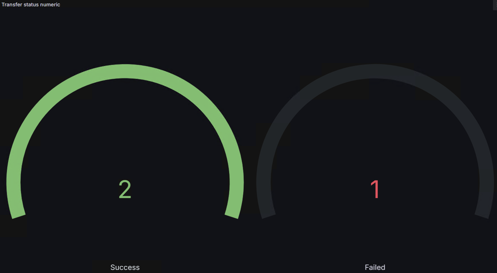

# IBM MQ Managed File Transfer: Visualize MFT status through Prometheus

IBM MQ Managed File Transfer agents publish status messages to SYSTEM.FTE topic on coordination queue manager. The status messages include agent, transfer status, monitor status and others. The content of the messages is in Xml format which may not be very useful if the data needs to be visualized. Most modern applications use Json as the format.

This application subscribes to SYSTEM.FTE topic and consumes the Xml messages. The Xml messages are then converted to Json which can then be pushed to Prometheus

The Json format message is pushed to Prometheus using pushgateway for monitoring and visualization. The Pushgateway temporarily holds the Json format messages and lets the prometheus server scrape the data from the https pushgateway source, Grafana uses the data from the prometheus to display the dashboard.
 
Prometheus is a monitoring system that collects and stores the time-series data which can be integrated with grafana for visualization.

## Prerequisites

1. Install IBM MQ and MFT.
 - Use the documentation to set up [MFT](https://www.ibm.com/docs/en/ibm-mq/9.4.x?topic=transfer-configuring-mft-first-use).
2. Install JDK - jdk-21.0.6.
3. Use the resource to set up mft [IBM Managed File Transfer Configuration Guide](https://community.ibm.com/community/user/viewdocument/ibm-managed-file-transfer-configura?CommunityKey=183ec850-4947-49c8-9a2e-8e7c7fc46c64&tab=librarydocuments&hlmlt=BL).
4. Install latest version of Prometheus from [here](https://prometheus.io/download/).
5. Install latest version of Prometheus Pushgateway [Pushgateway](https://prometheus.io/download/).
6. Download the following jar file and add it into lib folder.
    - [jackson-annotations-2.14.0.jar](https://repo1.maven.org/maven2/com/fasterxml/jackson/core/jackson-annotations/2.14.0/)
    - [jackson-databind-2.11.1.jar](https://repo1.maven.org/maven2/com/fasterxml/jackson/core/jackson-databind/2.11.1/)
    - [jackson-core-2.15.2.jar](https://repo1.maven.org/maven2/com/fasterxml/jackson/core/jackson-core/2.15.2/)
    - [json-20250107.jar](https://repo1.maven.org/maven2/org/json/json/20250107/)
    - [prometheus-metrics-core-1.3.0.jar](https://repo1.maven.org/maven2/io/prometheus/prometheus-metrics-core/1.3.0/)
    - [prometheus-metrics-exporter-pushgateway-1.3.0.jar](https://repo1.maven.org/maven2/io/prometheus/prometheus-metrics-exporter-pushgateway/1.3.0/)
    - [simpleclient_common-0.16.0.jar](https://repo1.maven.org/maven2/io/prometheus/simpleclient_common/0.16.0/)
    - [simpleclient_httpserver-0.16.0.jar](https://repo.maven.apache.org/maven2/io/prometheus/simpleclient_httpserver/0.16.0/)
    - [simpleclient_pushgateway-0.16.0.jar](https://repo1.maven.org/maven2/io/prometheus/simpleclient_pushgateway/0.16.0/)
    - [simpleclient-0.16.0.jar](https://repo1.maven.org/maven2/io/prometheus/simpleclient/0.16.0/)
7. Check if MQ allclient jar exists else download from [here](https://central.sonatype.com/search?q=a:com.ibm.mq.allclient&smo=true).
8. Install latest version of [Grafana](https://grafana.com/grafana/download).


## Repository Structure

This repository contains the following directories, each serving a specific purpose:

1. json_data_models_dashboards : Users can define and load dashboards into Grafana, enabling consistent and reproducible visualization of data.
2. xml-metrics-exporter : Contains two java application the first application consumes the messages from SYSTEM.FTE.TOPIC and converts to Json format while the second application would export the data into prometheus


## Getting started

1. Clone the repository into the local machine using the [link](https://github.ibm.com/B-C-Surag/mft-metrics-exporter.git).
2. Check if the Queue  manager is running and the agent is ready.
3. Start the Prometheus server, This lauches prometheus to start collecting metrics.
4. Start the PushGateway server, This makes the pushgateway available to temprovoraly store the metrics until Prometheus scrapes it.
5. Compile the XMLToJson.java file.
6. Run the XMLToJson file, This would convert the xml messages into Json format and sends the converted messages to Prometheus for monitoring and creating Dashboard.


## Compiling and running the file

1. Navigate to the Prometheus folder and run the following command in the terminal to start the Prometheus Server.
    ```
    prometheus
    ```

2. Navigate to the Pushgateway folder and run the following command in the terminal to start the Pushgateway.
    ```
    pushgateway
    ```

3. In any Browser run localhost:3000 to start grafana.

4. Use the below command to compile the file.

    for Windows
    ``` 
    javac -cp "lib/*;C:\Program Files\IBM\MQ\java\lib\com.ibm.mq.allclient.jar" xml_metrics_exporter/*.java
    ```

    for Linux
    ```
    javac -cp ".:lib/*:/opt/mqm/java/lib/com.ibm.mq.allclient.jar" xml_metrics_exporter/*.java
    ```

5. Use the below command to run the file (Replace the command with names of the queue manager name, destination name, host name, port name, channel name, user name, password and time out in seconds(optional)).

    for Windows
    ``` 
    java -cp ".;lib/*;C:\Program Files\IBM\MQ\java\lib\com.ibm.mq.allclient.jar" xml_metrics_exporter.XMLToJson -m <queueManagerName> -d <destinationName> -h <host> -p <port> -l <channel> -u <user> -w <passWord> -t <timeout_seconds> 
    ```

    for Linux
    ```
    java -cp ".:lib/*:/opt/mqm/java/lib/com.ibm.mq.allclient.jar" xml_metrics_exporter.XMLToJson -m <queueManagerName> -d <destinationName> -h <host> -p <port> -l <channel> -u <user> -w <passWord> -t <timeout_seconds>
    ```

6. If the timeout is not provided as a parameter then the application runs infinitely.

## Viewing Dashboards in Grafana

1. Copy the Json data models in the repository.
2. Navigate into create dashboard in localhost:3000.
3. Click on create Dashboards -> new dashboard.
4. Add data source as Prometheus.
5. Navigate to the settings in the top right corner.
6. Paste the Json data model files to view the dashboard.
7. Repeat the steps to view the required dashboards.

## Purpose
1. XML format has a complex tag structure that makes it difficult to fetch the required data for analysis and monitoring, while the json format has a simple key-value structure that makes it easy to fetch the specific data for analysis.
2. The Json message is then pushed into Prometheus using Pushgateway and Dashboard is created that shows the details of the fle transfer.

## Sampe dashboard

1. Pie chart representing the number of file transfer that were successful or failed.
 - 

2. Guage representing the number of success and failure.
 - 
